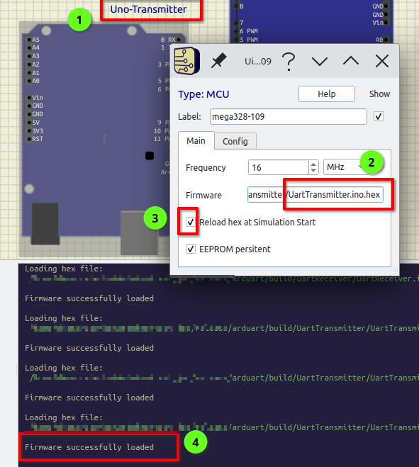
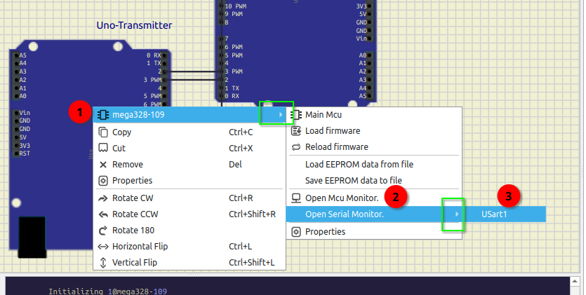
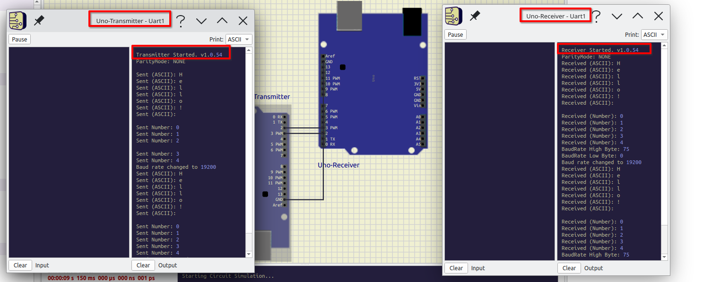

# Simple UART Implementation for Arduino

This project implements a **simple UART** (Universal Asynchronous Receiver-Transmitter) communication system on Arduino. It includes two main components:
- **UartReceiver**: Reads data from the UART serial port.
- **UartTransmitter**: Sends data over the UART serial port.

These sketches use a custom `UartIO` library to encapsulate the communication functions. The project is set up to be easily compiled for Arduino using `arduino-cli`.

## Table of Contents
- [Setup and Configuration](#setup-and-configuration)
- [Building the Project](#building-the-project)
- [Simulating the Project with SimulIDE](#simulating-the-project-with-simulide)
- [Application Logic](#application-logic)
- [Protocol Details](#protocol-details)
- [License](#license)
- [Additional Resources](#additional-resources)

---

## Setup and Configuration

### 1. **Arduino CLI**

You need the **Arduino CLI** to compile and upload the code to your Arduino board. The Arduino CLI is a command-line tool that provides full access to the Arduino build system.

- **Installation**:
  - Follow the [official installation guide for Arduino CLI](https://arduino.github.io/arduino-cli/latest/installation/).
  - Once installed, run `arduino-cli` from the command line to check if it works.

### 2. **Arduino AVR Core**

You need to install the **Arduino AVR core** for compiling sketches for AVR-based boards (like the Arduino Uno).

- To install it, run the following commands:
  ```bash
  arduino-cli core update-index
  arduino-cli core install arduino:avr
  ```

### 3. **Make**

A Makefile is provided for easy building of the project. Install **Make** on your system if you don’t already have it.

- **Installation**:
  - For **Linux** (Debian-based):
    ```bash
    sudo apt-get install make
    ```
  - For **macOS**:
    ```bash
    brew install make
    ```
  - For **Windows**, you can install **MinGW** or use Windows Subsystem for Linux (WSL).

### 4. **SimulIDE**

SimulIDE is a simple real-time electronics simulator that can be used to simulate the UART communication between the transmitter and receiver.

- **Installation**:
  - Download the latest version of SimulIDE from the [official website](https://simulide.com/).
  - Extract the downloaded archive and run the `simulide` executable.

### 5. **Directory Structure**:
   - `lib/UartIO/`: Contains the `UartIO.cpp` and `UartIO.h` files with functions for UART communication.
   - `UartReceiver/`: Contains the `UartReceiver.ino` sketch for receiving data over UART.
   - `UartTransmitter/`: Contains the `UartTransmitter.ino` sketch for transmitting data over UART.
   - `simulIDE_project/`: Includes `.sim1` files for simulation.

---

## Building the Project

### 1. **Compile Using Makefile**:

- cd into project directory
- To compile both `UartReceiver` and `UartTransmitter`:

  ```bash
  make
  ```

- To compile only the receiver or transmitter:

  ```bash
  make receiver   # to build UartReceiver.ino
  make transmitter   # to build UartTransmitter.ino
  ```

- To clean the build folder (delete generated files):

  ```bash
  make clean
  ```

The compiled `.hex` files will be placed in the `build/UartReceiver/` and `build/UartTransmitter/` directories.

---

## Simulating the Project with SimulIDE

### 1. **Open the Simulation File**:
   - Launch SimulIDE.
   - Open the `ArduinoUART.sim1` file located in the `simulIDE_project/` directory.

### 2. **Set Firmware Paths**:
   - Ensure SimulIDE is installed and working.
   - Open the `ArduinoUART.sim1` file located in the `simulIDE_project/` directory. Or you can Drag-n-Drop it directly into the IDE.
   - Configure the paths to the firmware for both devices:
      1) To update the firmware path for the device, do a right click on the device and select <Device Name>->Properties like on the image below:<br>
      2) Paste the path to firmware and hit enter<br>
      3) You will see the output: Firmware successfully loaded
      <br>
      
     - For the **Transmitter**:
       - Set the full path to `build/UartTransmitter/UartTransmitter.ino.hex`.
     - For the **Receiver**:
       - Set the full path to `build/UartReceiver/UartReceiver.ino.hex`.

### 3. **Run the Simulation**:
   - Open serial terminal for both devices to see the output
   <br>
   
   - Start the simulation by clicking the **Start simulation** button in SimulIDE.
   <br>
   
   - Observe the UART communication between the transmitter and receiver.
   <br>
   

---

## Application Logic

### Transmitter Logic
1. **Initialization**:
   - The transmitter initializes the UART interface with the configured `TxPin`, `RxPin`, and `BaudRate`.
   - It prints startup information, including the firmware version and parity bit.

2. **Mode Switching**:
   - Before transmitting data, the transmitter sends the `MODE_SWITCH` command (`0xFE`) followed by the desired mode (e.g., `ASCII`, `NUMBER`, or `BAUD_RATE`).
   - This ensures the receiver switches to the correct mode before processing the data.

3. **Data Transmission**:
   - In `ASCII` mode, the transmitter sends a predefined string of ASCII characters (e.g., "This is UART ASCII symbols transmition test!").
   - In `NUMBER` mode, the transmitter sends a predefined array of numeric values (e.g., 0, 1, 2, 3, 4).

4. **Baud Rate Change**:
   - To change the baud rate, the transmitter sends:
     - `MODE_SWITCH` (`0xFE`).
     - `BAUD_RATE` (`'b'`).
     - The new baud rate as two bytes (high byte followed by low byte).
   - After sending the new baud rate, the transmitter updates its own UART configuration to match the new baud rate.

5. **Delays**:
   - **Stability Delays**: A small delay (`1 ms`) is added after sending mode-switch commands in the transmitter to ensure the receiver has time to process the mode change.
   - **Data Transmission Delays**:
     - Both the transmitter and receiver now use the same configurable delay, defined as `constexpr int DataSendDelayMs;` in `UartConfig.h`.
     - This delay ensures proper synchronization between the transmitter and receiver while maintaining readability in the serial output.

### Receiver Logic
1. **Initialization**:
   - The receiver initializes the UART interface with the configured `TxPin`, `RxPin`, and `BaudRate`.
   - It prints startup information, including the firmware version and parity bit.

2. **Mode Switching**:
   - The receiver listens for the `MODE_SWITCH` command (`0xFE`).
   - Upon receiving `MODE_SWITCH`, the receiver reads the next byte to determine the new mode (`ASCII`, `NUMBER`, or `BAUD_RATE`).
   - The receiver updates its `currentMode` state and prints a descriptive message (e.g., "Switched to mode: ASCII") using the `protocolCommandToStr` function.

3. **Data Processing**:
   - In `ASCII` mode, the receiver interprets incoming bytes as ASCII characters and prints them to the serial monitor.
   - In `NUMBER` mode, the receiver interprets incoming bytes as numeric values and prints them to the serial monitor.

4. **Baud Rate Change**:
   - In `BAUD_RATE` mode, the receiver:
     - Reads two bytes (high byte and low byte) to calculate the new baud rate.
     - Updates its UART configuration to match the new baud rate.
     - Prints the new baud rate to the serial monitor.

5. **Error Handling**:
   - If an unknown mode is received, the receiver prints an error message.
   - If data reception fails, the receiver retries after a short delay.

---

## Protocol Details

#### Command Constants
The following constants are used in the protocol:

| Command       | Value   | Description                       |
|---------------|---------|-----------------------------------|
| `MODE_SWITCH` | `0xFE`  | Reserved byte for mode switching. |
| `ASCII`       | `'c'`   | ASCII data mode.                 |
| `NUMBER`      | `'d'`   | Numeric data mode.               |
| `BAUD_RATE`   | `'b'`   | Baud rate configuration mode.    |

#### Mode Switching
- The transmitter sends `MODE_SWITCH` (`0xFE`) followed by the desired mode.
- The receiver updates its `currentMode` state and processes subsequent data according to the selected mode.

#### Baud Rate Configuration
- To change the baud rate, the transmitter sends:
  1. `MODE_SWITCH` (`0xFE`).
  2. `BAUD_RATE` (`'b'`).
  3. The new baud rate as two bytes (high byte followed by low byte).
- The receiver combines the two bytes to calculate the new baud rate and updates its UART configuration.

---

## License

This project is licensed under the MIT License - see the [LICENSE](LICENSE) file for details.

---

### Additional Resources:
- [Learn the basics of Universal Asynchronous Receiver-Transmitter (UART)](https://docs.arduino.cc/learn/communication/uart/)
- [UART - Wikipedia](https://en.wikipedia.org/wiki/Universal_asynchronous_receiver-transmitter)
